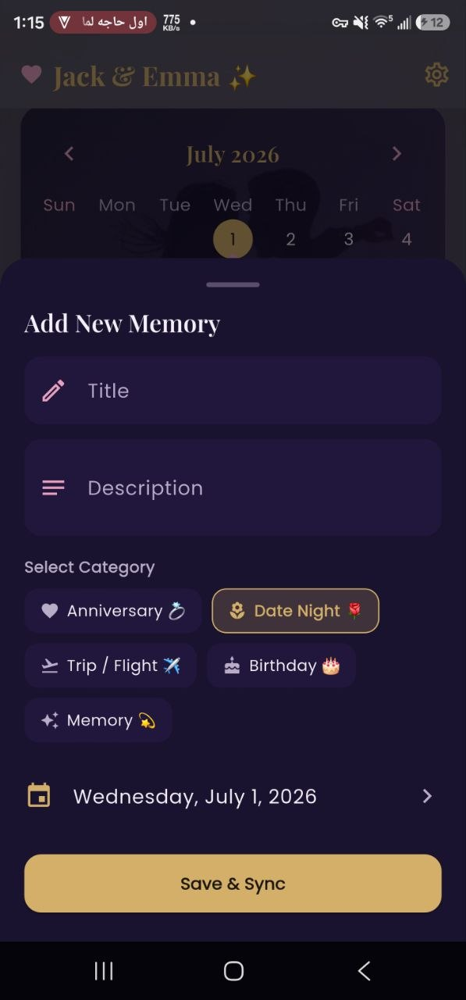
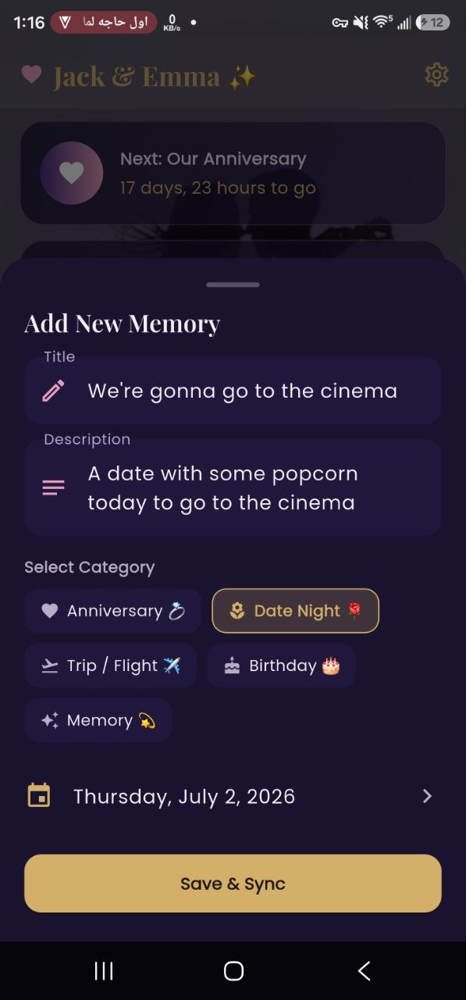
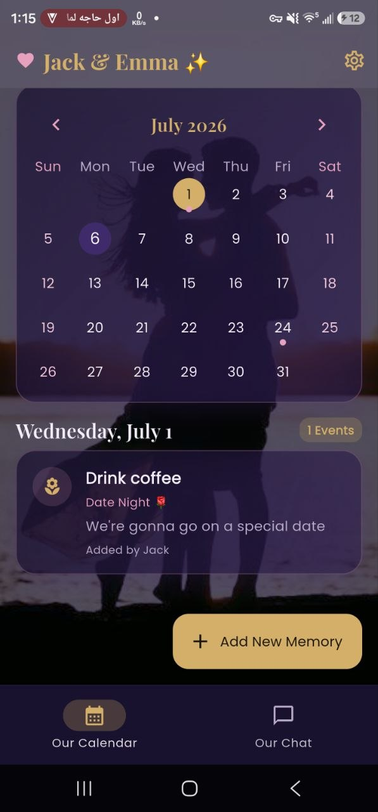

# 💬 MeetSync

### Smart Chat & Calendar Platform

## Where Communication Meets Productivity

A modern cross-platform application that combines real-time messaging with an intelligent calendar, reminders, and event planning into one seamless experience.

---

# 🎬 Demo

> *(Add your demo video or YouTube link here.)*

---

# 📱 About

MeetSync is a premium communication platform developed entirely with **Flutter**.

Unlike traditional messaging applications, MeetSync combines real-time chat with an integrated smart calendar, allowing users to organize meetings, events, reminders, and daily activities without leaving the conversation.

The goal of the project is to simplify communication while improving productivity through a clean interface, elegant animations, and an intuitive scheduling experience.

Built with a single Flutter codebase, the application delivers a consistent experience across **iOS**, **Android**, and **Web**.

---

# ✨ Key Features

- 💬 Real-Time Messaging
- 📅 Integrated Smart Calendar
- 🔔 Smart Reminder System
- 📆 Event Scheduling
- 👥 Group Planning
- 🎨 Premium UI Design
- ✨ Smooth Flutter Animations
- 🌙 Dark Mode
- ⚡ High Performance
- 📱 Fully Responsive Layout
- 🌐 Cross Platform Support
- 🔒 Secure Architecture

---

# 🚀 Why MeetSync?

Most messaging applications require users to switch between multiple apps for communication and scheduling.

MeetSync eliminates this problem by integrating everything into one application.

Users can:

- Chat with friends
- Schedule meetings
- Organize events
- Create reminders
- Manage personal plans
- Stay productive

—all without leaving the conversation.

---

# 🎨 User Experience

The interface was designed with simplicity, speed, and elegance in mind.

### Highlights

- Modern Interface
- Minimal Design
- Premium Typography
- Responsive Layout
- Beautiful Components
- Smooth Navigation
- Intuitive User Flow

Every interaction has been carefully crafted to provide a premium experience.

---

# ✨ Flutter Animations

MeetSync includes numerous custom animations such as:

- Hero Animations
- Animated Page Transitions
- Calendar Animations
- Chat Bubble Animations
- Interactive Buttons
- Gesture Animations
- Loading Effects
- Smooth Navigation
- Animated Dialogs

Animations are designed to enhance usability while maintaining excellent performance.

---

# 📅 Smart Calendar

The integrated calendar allows users to:

✅ Create Events

✅ Schedule Meetings

✅ Plan Activities

✅ Organize Daily Tasks

✅ Manage Personal Events

✅ Receive Automatic Reminders

Everything is synchronized directly with conversations.

---

# 🔔 Reminder System

Stay organized with:

- Event Notifications
- Meeting Reminders
- Daily Tasks
- Activity Alerts
- Personal Reminders
- Smart Scheduling

---

# 📱 Cross Platform

Built using Flutter.

Supported Platforms:

- 🍎 iOS
- 🤖 Android
- 🌐 Web

A single codebase ensures consistency, scalability, and maintainability.

---

# 🛠 Technology Stack

## Framework

- Flutter

## Programming Language

- Dart

## UI

- Material Design
- Custom Widgets
- Responsive Layout

## Architecture

- Modular Flutter Architecture
- Scalable Components
- Cross Platform Design

---

# 🚀 Performance

✔ Optimized Rendering

✔ Smooth 60 FPS Animations

✔ Fast Navigation

✔ Responsive Layout

✔ Lightweight Architecture

✔ Production Ready

---

# 📸 Application Preview

<table>
<tr>
<td align="center">
  
<b>💬 Real-Time Chat</b>
</td>

<td align="center">
  
<b>📅 Smart Calendar</b>
</td>
</tr>

<tr>
<td align="center">
  
<b>🔔 Reminder System</b>
</td>

</tr>
</table>

---

# 🎯 Project Goals

- Deliver a premium messaging experience.
- Integrate communication and planning.
- Create a clean and intuitive workflow.
- Build a scalable Flutter architecture.
- Maintain high performance across all platforms.
- Simplify daily organization for users.

---

# 🔒 Source Code

The complete source code is private.

This repository is intended to showcase the application's user interface, user experience, and overall functionality.

The project contains proprietary implementations, custom architecture, and production-ready components that are not publicly available.

Technical discussions and implementation details are available during professional interviews upon request.

---

# 👨‍💻 Developer

## Hany Reda

**Senior Product Engineer**

AI • Flutter • Full Stack • Mobile Development • UI/UX • SaaS • Unreal Engine

I specialize in building complete digital products from concept to production, combining software engineering, artificial intelligence, user experience design, and scalable architectures.

---

# 🌍 Connect With Me

## 🌐 Portfolio

https://hany15.github.io/Hany-Reda-Portfolio/

---

## 💼 LinkedIn

https://www.linkedin.com/in/hany-reda-854667417

---

## 📧 Email

developeractionobject@gmail.com

---

# ⭐ Support

If you enjoyed this project, consider giving this repository a ⭐.

Thank you for visiting MeetSync.
